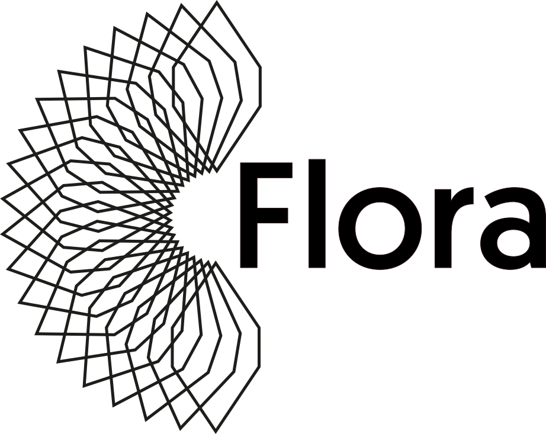

  <picture>
    <source media="(prefers-color-scheme: dark)" srcset="./banners/logo-dark-background.png">
    
  </picture>

<h1 align="center"><small>A package index for the Haskell ecosystem</small> </h1>

<dl>
  

  <dt>Flora.pm</dt>
  <dd>A meta-index that gathers Haskell package from across the ecosystem.</dd>
 

  

  <dt>Flora Server</dt>
  <dd>An alternative package repository for your ecosystem.</dd>
  

</dl>

## ⚡ Features

* 📁 Curated category model, with elimination of duplicates
* 🏛️ Package namespaces, so that packages with the same name can live without conflict
* 🌓 Dark and light modes
* 📱 Mobile user interface

## 📖 Guides 

Visit https://flora.pm/documentation for explanations on what Flora can do.

## 🤝 Contributing

We welcome new contributors! Join the [Matrix chatroom](https://app.element.io/#/room/#flora-pm:matrix.org) or open a [Discussion](https://github.com/flora-pm/flora-server/discussions/new/choose).

To setup a local installation, see [CONTRIBUTING.md#project-setup](https://github.com/flora-pm/flora-server/blob/development/CONTRIBUTING.md#project-setup)

## 📖 Read More

* [Code of Conduct](./CODE_OF_CONDUCT.md)
* [Development Wiki](https://github.com/flora-pm/flora-server/wiki)

## 🫶 Special Collaborations

We would like to thank our dear friends at Guérilla Studio ([www](https://guerilla.studio/), [GitHub](https://github.com/GuerillaStudio)) for help with accessibility and CSS integration.
