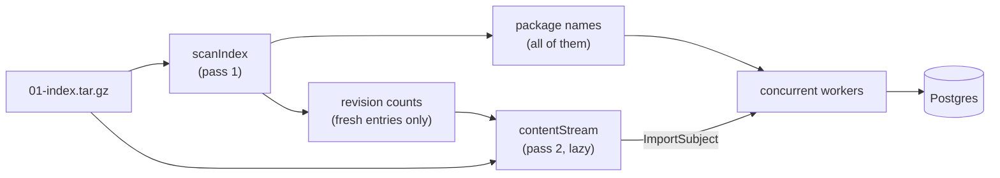
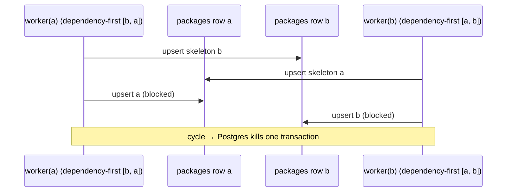
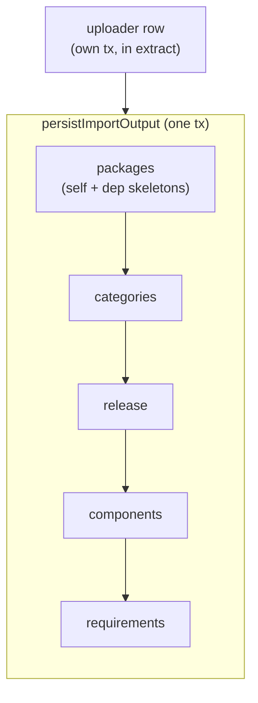

# The package import pipeline

The package import pipeline is an essential part of what makes Flora,
and contains non-obvious invariants that you should know about.

The entrypoint is `importFromArchive`, called by the `RefreshIndex` job in
`FloraJobs.Runner` and by the CLI. It walks the archive, then hands the
resulting stream to `importFromStream`, which runs the import workers.

## Shape of the pipeline

An index tarball is called `01-index.tar.gz`, full of
`<package>/<version>/<package>.cabal` entries.
The same archive is walked **twice**, on purpose:

1. Pass 1 is a fold: it collects every package name the index declares, and counts
how many revisions each cabal path has.
2. Pass 2 streams the cabal files lazily, yielding only the last entry per path
(the newest metadata revision).
The revision counts from pass 1 are the countdown that makes "last entry"
knowable on the spot, without retaining the earlier entries.

However the compressed archive is still retained. See [Memory](#memory) for
further details.

Package names come from pass 1 unfiltered by timestamp,
because they feed `chooseNamespace`. An incremental import still has
to resolve a dependency on a package whose cabal file it is skipping.
Namespaces resolve against the local index first, then its declared
dependency indexes, in order. This order is created by the `Vector.cons`
in `importFromArchive`.

Each worker then does, per cabal file:

1. parse into a `GenericPackageDescription`
2. `extractPackageDataFromCabal` producing an `ImportOutput`.
    The IDs it derives form a chain, each link hashing the previous one:
    `PackageId` from namespace + name, `ReleaseId` from `PackageId` + version,
    `ComponentId` from `ReleaseId` + the component's canonical form, and
    `RequirementId` from `ComponentId` + the dependency's `PackageId`.
3. `persistImportOutput` then does the persistence.

A worker that fails on one file emits a log line, and bumps a counter,
but the stream keeps going. After the stream is done, an import of **at least
20 files** (`minimumSampleSize`) whose failure rate exceeds 1% throws
`TooManyImportFailures`. Below that floor nothing is thrown however bad the
rate, because one failure out of three is not a signal.

Worker count is half of the available connections, floored at 1
(`importWorkerLimit`). A worker needs to hold at most one connection at a time
(see [the `ReadDB`/`WriteDB` split](./overview.md#read-only-and-read-write-operations)),
so halving leaves enough connections in that pool for the rest of the work drawing on it.

A pool exhaustion stall looks exactly like a deadlock while being much less fun to diagnose.

## Invariants

These are the pipeline-wide obligations and the mechanisms that enforce them.

<dl>

<dt>Idempotence.</dt>
<dd>

Re-importing an index must be a no-op. Every ID on this path but one is
derived rather than randomly generated: `deterministicPackageId namespace name`,
`deterministicReleaseId packageId version`,
`deterministicFeedEntryId packageId version`, and so on.

Every write is an upsert, an `ON CONFLICT DO NOTHING`, or an idempotent
`UPDATE`: the status promotion in `upsertPackageWithDependencies`,
`updateTestedWith`, and `updateReleaseUploader` are plain `UPDATE`s that land on
the same value twice.

</dd>

<dt>Order-independence.</dt>
<dd>
Packages may be imported in any order, before or after their dependencies.
</dd>

<dt>Status only ever goes up.</dt>
<dd>

Nothing downgrades a package from `FullyImportedPackage`
back to `UnknownPackage`.

As such, `packageInsertOrder` must append the package
being imported *after* the dependencies before deduplicating, so `dedupOn`'s
last-wins keeps the real package over a skeleton of itself. This happens when
a test suite depending on its own library is put among the dependencies.
</dd>

<dt>Both passes must agree on freshness.</dt>
<dd>

`isFresh` is shared between `scanIndex`
and `contentStream`. If they disagree, pass 1 counts revisions pass 2 never sees,
the countdown never reaches zero, and cabal files will vanish from the
import.

</dd>

<dt>Progress is committed even on failure.</dt>
<dd>

The materialised views (`refreshLatestVersions`, `refreshDependents`) and the index timestamp are updated
in a `finally`, so a crashed import still narrows what the next one has to read.
</dd>
</dl>

## Memory

A full Hackage index is big enough that this path is arranged around retaining
as little of it as it can. One *compressed* archive per index does stay resident
for the whole import.

1. The reading of the archive **is strict**. The two passes from above read the
   same `localArchive`, so the compressed bytes are held once rather than the
   file being read twice. Each declared dependency index is read the same way,
   so an instance with dependency indexes holds one compressed archive per index.

2. `contentStream` filters the countdown map to paths with more than one
   entry, and `step` reads an absent key as "one entry left". What survives into
   the stream is therefore proportional to the number of *revised* paths, not to
   the size of the index.

3. `Archive.hs` is compiled with `{-# OPTIONS_GHC -fno-full-laziness #-}`. It is
   there to stop GHC from floating the archive reading out of the passes and
   turning it into a thunk retained across both. It looks like noise. It is not.

Do not drop any of these without measuring against a real full index. Nothing in
the test suite is large enough to catch the regression.

## Deadlocks

### Rules

1. **Order every multi-row write whose rows two importers can both reach, by
   primary key.** `dedupOn` gives us both properties at once: `Map.elems`
   output is key-ordered. The table below says which writes those are, and which need nothing.
2. **Never blind-`INSERT` a row two importers might both want.** Use
   `ON CONFLICT DO NOTHING`, then re-read (see `getOrInsertPackageUploader`).
3. **Never nest `withReadWritePool`, and never hold a connection while waiting
   for another one.** A cabal file takes *up to two* write transactions: the
   uploader lookup during extraction, then `persistImportOutput` (they run
   one after the other, so a worker only ever holds one connection).

### Why

Packages reference each other. Importing `a` writes a `packages` row for `a` *and*
an `UnknownPackage` skeleton for everything `a` depends on. A worker writes
rows for packages it is not importing. This means that two workers can attempt
to write the same row if one is writing the package itself and the other is
writing the skeleton dependency.

| rows written | another worker can reach it | what keeps that safe |
|---|---|---|
| `packages`: self + dependency skeletons | yes: a worker importing one of those dependencies as its own package, and a worker importing a *different version* of the same package (the stream keys on `<package>/<version>/…`, so versions run concurrently) | ordered by `PackageId` (rule 1, via `packageInsertOrder`/`dedupOn`) |
| `package_categories` | yes: another version of the same package writes the identical join rows. Two workers on *different* packages never do | `sortOn (.categoryId)` in `persistImportOutput` (rule 1) |
| `package_uploaders` | yes: every package of that maintainer; Hackage only | `ON CONFLICT DO NOTHING` then re-read (rule 2), `getOrInsertPackageUploader` |
| `requirements` | no. `RequirementId` derives from `ComponentId` + the dependency's `PackageId` | no lock rule. However `bulkUpsertRequirements` must still dedup (see below) |

For instance, without rule 1, for a mutually dependent pair the two orders
are reversed by construction:
`packageInsertOrder` builds `dependencies <> [package]`,
so worker(a) has `[b, a]` and worker(b) has `[a, b]`:

The requirement dedup is not about locks (this time…): `upsertMany` rejects a batch
containing the same primary key twice, because `ON CONFLICT DO UPDATE` cannot
update a row the same statement just inserted. Remove the dedup in
`bulkUpsertRequirements` and you get a SQL error.

The `package_uploaders` collision is a uniqueness problem rather than an ordering
one, hence rule 2.

The order inside one transaction:

