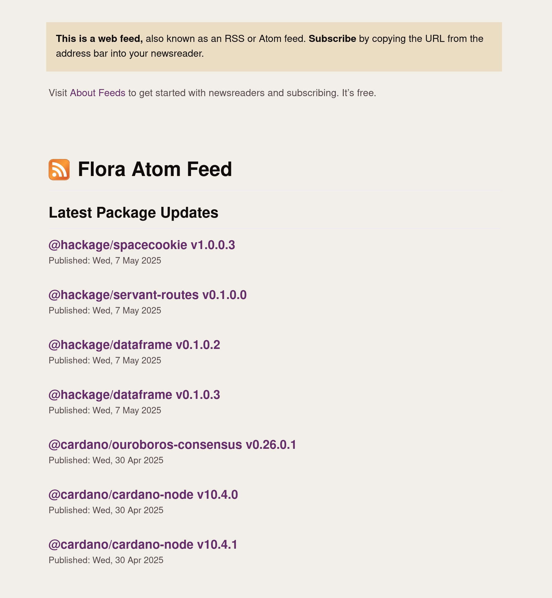

Flora offers Atom feeds to subscribe to package updates. You can build your feed in https://flora.pm/feed with the packages that you wish to follow.

Such a URL:

```
/feed/atom.xml?packages[]=@hackage/servant-routes
  &packages[]=@hackage/dataframe
  &packages[]=@hackage/spacecookie
  &packages[]=@cardano/ouroboros-consensus
  &packages[]=@cardano/cardano-node
```

Will give you a feed like this:


